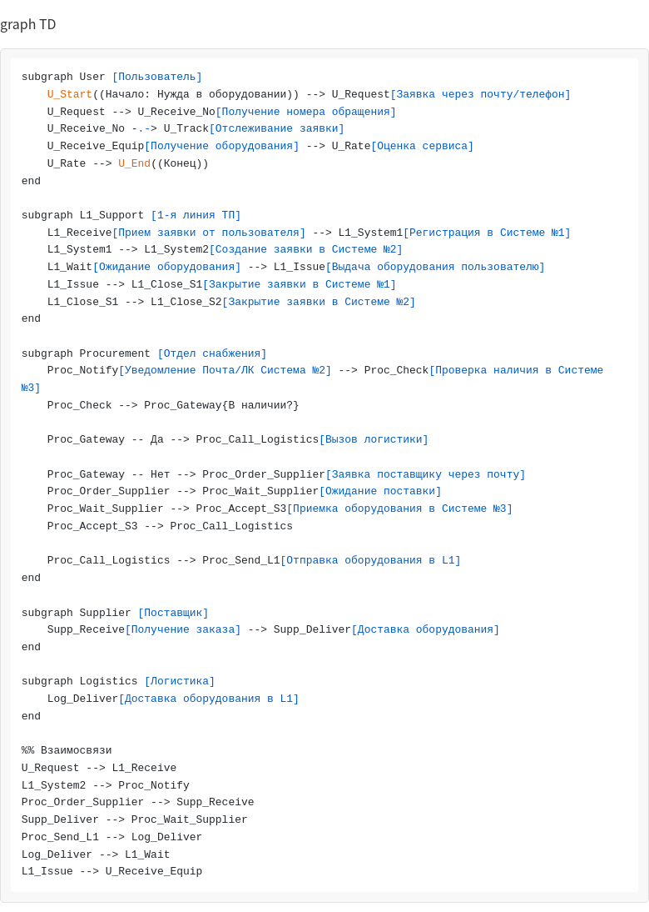

# BPMN 2.0: Процесс выдачи ИТ-оборудования

## Описание задачи

Анализ и моделирование процесса выдачи ИТ-оборудования пользователям в компании «X» на основе текстового описания. Задача включает создание BPMN 2.0 диаграммы, выявление противоречий и недостающих элементов в описании процесса.

## Исходное описание процесса

В компании «X» работает выдача ИТ-оборудования пользователям по заявке через систему №1. Процесс включает взаимодействие между пользователем, первой линией техподдержки, отделом снабжения, поставщиком и логистикой.

**Основной сценарий:**
- Пользователь офиса делает заявку через почту или телефон в 1-ю линию техподдержки
- Получает номер обращения для отслеживания
- L1 создает заявку в системе №2 для отдела снабжения
- Снабжение проверяет наличие оборудования в системе №3
- **Если оборудование есть:** вызывает логистику, отправляет в L1, L1 выдает пользователю, закрывает заявки
- **Если оборудования нет:** заказывает у поставщика, ждет доставку, принимает в системе №3, затем отправляет через логистику
- Пользователь получает оборудование и оценивает сервис

## BPMN 2.0 Диаграмма

Диаграмма показывает:
- **5 участников процесса:** Пользователь, L1 техподдержка, Отдел снабжения, Поставщик, Логистика
- **3 информационные системы:** Система №1 (учет заявок), Система №2 (взаимодействие со снабжением), Система №3 (складской учет)
- **Точка развилки:** Проверка наличия оборудования в системе №3
- **Два основных потока:** с наличием оборудования и с заказом у поставщика

## Выявленные противоречия и вопросы

### 1. Неясность в закрытии заявок при отсутствии оборудования

**Проблема:** Описание указывает, что техподдержка закрывает заявки в системах №1 и №2. Однако в сценарии заказа у поставщика неясно, кто и когда инициирует закрытие заявки в системе №2.

**Вопрос:** Происходит ли закрытие после получения оборудования L1 или на другом этапе?

### 2. Недостаточная детализация роли логистики

**Проблема:** Логистика описана кратко: "вызывают логистику и отправляют оборудование". Неясно:
- Является ли логистика просто перевозчиком или фиксирует действия в системах?
- Как логистика получает информацию о вызове (система, почта, телефон)?
- Есть ли подтверждение передачи оборудования в системах?

### 3. Отсутствие этапа подтверждения получения пользователем

**Проблема:** Нет явного этапа, когда пользователь подтверждает получение оборудования в системе №1 перед закрытием заявки.

**Риск:** Заявка может быть закрыта, но пользователь фактически не получил оборудование или не проверил его работоспособность.

### 4. Отсутствие сценариев сбоя поставки

**Проблема:** Описание не предусматривает, что происходит, если:
- Поставщик не может поставить оборудование
- Оборудование повреждено при доставке
- Поставщик отказывает в поставке

**Следствие:** Процесс не имеет механизма эскалации или альтернативных действий.

### 5. Неопределенность механизма вызова логистики

**Проблема:** Не конкретизировано, как происходит вызов логистики — через систему, по телефону, по почте или иным способом.

**Важность:** Это критично для понимания интеграции между отделами и времени выполнения.

## Недостающие элементы для полной модели

Для создания полноценной BPMN-модели, отражающей реальное состояние процесса («как есть»), необходимо уточнить:

| Элемент | Описание | Важность |
|---------|---------|----------|
| **События начала/окончания** | Точные триггеры и конечные состояния для каждого участника | Высокая |
| **Условия развилок** | Четкие критерии для принятия решений (например, критерии наличия оборудования) | Высокая |
| **Информационные потоки** | Какие данные передаются, в каком формате, через какие системы | Высокая |
| **Роли и ответственность** | Четкое определение зон ответственности каждого участника | Высокая |
| **Обработка исключений** | Действия при отказе поставщика, повреждении, отказе пользователя | Средняя |
| **Метрики и показатели** | Время выполнения, удовлетворенность пользователя, процент успеха | Средняя |
| **SLA и сроки** | Максимальное время обработки на каждом этапе | Средняя |
| **Системные интеграции** | API, синхронизация данных между системами №1, №2, №3 | Средняя |

## Рекомендации по улучшению процесса

1. **Документировать все интеграции** между системами и отделами
2. **Добавить явные точки подтверждения** на каждом этапе процесса
3. **Определить SLA** для каждого этапа (время обработки заявки, время доставки и т.д.)
4. **Создать обработчики исключений** для сценариев сбоя
5. **Автоматизировать уведомления** пользователю о статусе заявки
6. **Добавить контроль качества** перед выдачей оборудования пользователю

## Заключение

Предоставленное описание является хорошей отправной точкой, но требует уточнений для создания точной и полной BPMN-модели. Выявленные противоречия и недостающие элементы помогут улучшить процесс и избежать проблем при его реализации.

---

## Файлы в репозитории

- `README.md` — этот файл с полным анализом
- `bpmn_diagram.png` — BPMN 2.0 диаграмма процесса
- `ANALYSIS.md` — подробный анализ противоречий (опционально)
