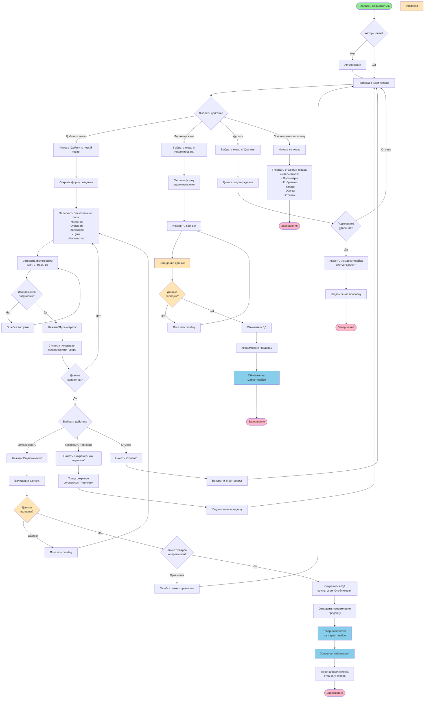

```mermaid
graph TD
    Start([Продавец открывает ЛК]) --> CheckAuth{Авторизован?}
    CheckAuth -->|Нет| Login[Авторизация]
    Login --> Dashboard[Переход в 'Мои товары']
    CheckAuth -->|Да| Dashboard
    
    Dashboard --> Action{Выбрать действие}
    
    Action -->|Добавить товар| NewProduct[Нажать 'Добавить новый товар']
    Action -->|Редактировать| EditProduct[Выбрать товар и 'Редактировать']
    Action -->|Удалить| DeleteProduct[Выбрать товар и 'Удалить']
    Action -->|Просмотреть статистику| ViewStats[Нажать на товар]
    
    %% Основной сценарий - создание товара
    NewProduct --> FormOpen[Открыть форму создания]
    FormOpen --> FillData[Заполнить обязательные поля:<br/>- Название<br/>- Описание<br/>- Категория<br/>- Цена<br/>- Количество]
    
    FillData --> UploadImages[Загрузить фотографии<br/>мин. 1, макс. 10]
    UploadImages --> ImageCheck{Изображения<br/>загружены?}
    ImageCheck -->|Нет| ImageError[Ошибка загрузки]
    ImageError --> UploadImages
    ImageCheck -->|Да| Preview[Нажать 'Просмотреть']
    
    Preview --> PreviewShow[Система показывает<br/>предпросмотр товара]
    PreviewShow --> Review{Данные<br/>корректны?}
    
    Review -->|Нет| FillData
    Review -->|Да| PublishChoice{Выбрать действие}
    
    PublishChoice -->|Опубликовать| Publish[Нажать 'Опубликовать']
    PublishChoice -->|Сохранить черновик| Draft[Нажать 'Сохранить как черновик']
    PublishChoice -->|Отмена| Cancel[Нажать 'Отмена']
    
    Draft --> DraftSave[Товар сохранен<br/>со статусом 'Черновик']
    DraftSave --> DraftNotif[Уведомление продавцу]
    DraftNotif --> Dashboard
    
    Cancel --> CancelNotif[Возврат в 'Мои товары']
    CancelNotif --> Dashboard
    
    Publish --> Validate[Валидация данных]
    Validate --> ValidCheck{Данные<br/>валидны?}
    
    ValidCheck -->|Ошибка| ValidationError[Показать ошибку]
    ValidationError --> FillData
    
    ValidCheck -->|OK| CheckLimit{Лимит товаров<br/>не превышен?}
    CheckLimit -->|Превышен| LimitError[Ошибка: лимит превышен]
    LimitError --> Dashboard
    
    CheckLimit -->|OK| SaveDB[Сохранить в БД<br/>со статусом 'Опубликован']
    SaveDB --> Notification[Отправить уведомление<br/>продавцу]
    Notification --> PublishMarketplace[Товар появляется<br/>на маркетплейсе]
    PublishMarketplace --> Success[Успешная публикация]
    Success --> SuccessPage[Перенаправление на<br/>страницу товара]
    SuccessPage --> End1([Завершение])
    
    %% Редактирование товара
    EditProduct --> EditForm[Открыть форму<br/>редактирования]
    EditForm --> EditData[Изменить данные]
    EditData --> EditValidate[Валидация данных]
    EditValidate --> EditValidCheck{Данные<br/>валидны?}
    EditValidCheck -->|Нет| EditError[Показать ошибку]
    EditError --> EditData
    EditValidCheck -->|Да| UpdateDB[Обновить в БД]
    UpdateDB --> EditNotif[Уведомление продавцу]
    EditNotif --> UpdateMarketplace[Обновить на маркетплейсе]
    UpdateMarketplace --> End2([Завершение])
    
    %% Удаление товара
    DeleteProduct --> DeleteConfirm[Диалог подтверждения]
    DeleteConfirm --> ConfirmChoice{Подтвердить<br/>удаление?}
    ConfirmChoice -->|Отмена| Dashboard
    ConfirmChoice -->|Да| DeleteDB[Удалить из маркетплейса<br/>статус 'Удален']
    DeleteDB --> DeleteNotif[Уведомление продавцу]
    DeleteNotif --> End3([Завершение])
    
    %% Просмотр статистики
    ViewStats --> StatsPage[Показать страницу товара<br/>с статистикой:<br/>- Просмотры<br/>- Избранное<br/>- Заказы<br/>- Оценка<br/>- Отзывы]
    StatsPage --> End4([Завершение])
    
    style Start fill:#90EE90
    style End1 fill:#FFB6C6
    style End2 fill:#FFB6C6
    style End3 fill:#FFB6C6
    style End4 fill:#FFB6C6
    style Success fill:#87CEEB
    style PublishMarketplace fill:#87CEEB
    style UpdateMarketplace fill:#87CEEB
    style Validation fill:#FFE4B5
    style ValidCheck fill:#FFE4B5
    style EditValidate fill:#FFE4B5
    style EditValidCheck fill:#FFE4B5
```
