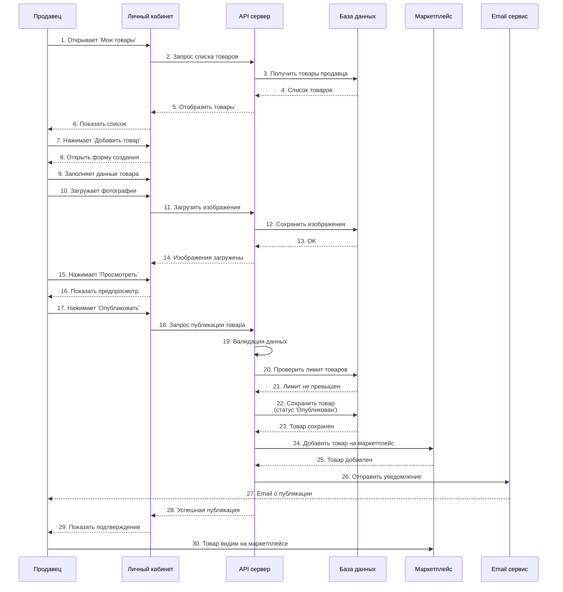

```mermaid
sequenceDiagram
    participant Seller as Продавец
    participant UI as Личный кабинет
    participant API as API сервер
    participant DB as База данных
    participant Marketplace as Маркетплейс
    participant Email as Email сервис

    Seller->>UI: 1. Открывает 'Мои товары'
    UI->>API: 2. Запрос списка товаров
    API->>DB: 3. Получить товары продавца
    DB-->>API: 4. Список товаров
    API-->>UI: 5. Отобразить товары
    UI-->>Seller: 6. Показать список

    Seller->>UI: 7. Нажимает 'Добавить товар'
    UI-->>Seller: 8. Открыть форму создания

    Seller->>UI: 9. Заполняет данные товара
    Seller->>UI: 10. Загружает фотографии
    UI->>API: 11. Загрузить изображения
    API->>DB: 12. Сохранить изображения
    DB-->>API: 13. OK
    API-->>UI: 14. Изображения загружены

    Seller->>UI: 15. Нажимает 'Просмотреть'
    UI-->>Seller: 16. Показать предпросмотр

    Seller->>UI: 17. Нажимает 'Опубликовать'
    UI->>API: 18. Запрос публикации товара
    API->>API: 19. Валидация данных
    API->>DB: 20. Проверить лимит товаров
    DB-->>API: 21. Лимит не превышен
    API->>DB: 22. Сохранить товар<br/>(статус 'Опубликован')
    DB-->>API: 23. Товар сохранен
    API->>Marketplace: 24. Добавить товар на маркетплейс
    Marketplace-->>API: 25. Товар добавлен
    API->>Email: 26. Отправить уведомление
    Email-->>Seller: 27. Email о публикации
    API-->>UI: 28. Успешная публикация
    UI-->>Seller: 29. Показать подтверждение

    Seller->>Marketplace: 30. Товар видим на маркетплейсе
```
